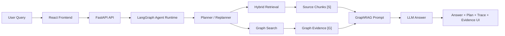

# PatentRAG: 中文专利 GraphRAG Agent 系统

PatentRAG 是一个面向中文专利文档的 Agentic RAG 项目。它围绕 20 篇中文专利 Markdown 文档，构建了从文档解析、混合检索、知识图谱、GraphRAG、LangGraph Agent 到可解释前端工作台的端到端系统。

项目重点不是“把多个 AI 技术名词串起来”，而是验证一个更具体的问题：**当用户询问专利中的技术问题、结构组件、方案效果和可借鉴设计时，系统如何同时给出答案、原文依据和结构化图谱证据。**

## Problem Statement

普通 RAG 可以从专利文本中召回相关片段，但在专利分析场景里，仅靠片段相似度往往不够：

- 同一个技术方案可能分散在摘要、背景技术、权利要求和说明书中。
- 用户常问的是“解决了什么问题”“用了哪些组件”“有哪些方案可以借鉴”，这些问题天然带有结构化关系。
- 面试或实际业务场景中，系统不能只给结论，还需要说明答案来自哪些原文片段和图谱证据。

因此，本项目在 Hybrid Retrieval 之上增加了专利技术图谱和 GraphRAG，将原文证据 `[S]` 与图谱证据 `[G]` 一起纳入生成过程，并在前端展示 Agent 的规划、工具调用和证据来源。

## Design Goals

- **可检索**：支持关键词、向量和混合检索，覆盖不同表达方式的专利问题。
- **可追溯**：回答中保留原文 chunk 与图谱证据，避免只有模型自由生成。
- **可解释**：前端展示 Plan、Trace、LangGraph node trace 和 evidence cards。
- **可评估**：提供 GraphRAG 问题集和自动评估脚本，记录证据命中与引用覆盖。
- **可扩展**：Agent、检索、图谱抽取和评估模块保持相对独立，便于后续替换模型或扩展工具。

## Implemented Capabilities

| Subsystem | What is implemented |
| --- | --- |
| Document pipeline | Parse raw Chinese patent Markdown into structured patent records and retrieval chunks. |
| Retrieval | BM25 keyword search, Chroma vector search, and Hybrid Retrieval. |
| Knowledge graph | Build a patent graph with Patent, Claim, Keyword, IPC, Applicant and technical semantic nodes. |
| LLM technical extraction | Extract TechnicalField, Problem, Component, Solution and Effect nodes with optional LLM extraction. |
| GraphRAG | Combine retrieved chunks and graph evidence into answer generation. |
| Agent runtime | Use LangGraph to run planning, tool execution, graph-enhanced QA, self-check and finalization. |
| Frontend observability | React workspace for answer, plan, trace, node trace, source evidence and graph evidence. |
| Evaluation | GraphRAG evaluation cases, automated result recording and citation/hit-rate metrics. |

## Key Design Decisions

### Why Hybrid Retrieval instead of vector-only search?

Patent text contains many exact technical terms, publication numbers, IPC classes and component names. BM25 is useful for exact lexical matches, while vector search helps with semantic variants. The system therefore keeps both and uses hybrid retrieval when answering open-ended questions.

### Why add graph evidence on top of RAG?

Many patent questions are relational: a component solves a problem, a structure produces an effect, or a patent belongs to a technical field. A graph representation makes these relations explicit and allows the answer generator to receive structured evidence, not only raw text chunks.

### Why use LangGraph?

The Agent flow contains multiple states: planning, retrieval, graph expansion, GraphRAG answer generation, self-check and final assembly. LangGraph makes these intermediate states observable and easier to debug than a single opaque function chain.

### Why show evidence in the frontend?

For this project, the UI is not just a chat page. It is an inspection surface for the whole RAG/Agent pipeline. Showing source evidence, graph evidence and traces makes it possible to judge whether a wrong answer came from retrieval, graph matching, planning or generation.

## Architecture



## Tech Stack

| Layer | Technologies |
| --- | --- |
| Backend | FastAPI, Pydantic, Typer |
| Agent Runtime | LangGraph |
| Retrieval | BM25, Chroma, Hybrid Search |
| Knowledge Graph | NetworkX JSON graph |
| LLM Integration | OpenAI-compatible client, DashScope/Qwen |
| Frontend | React, TypeScript, Vite |
| Testing | pytest, Node test runner |

## Repository Structure

```text
configs/              Configuration templates
data/                 Local data, indexes, graph artifacts, evaluation cases
docs/                 Architecture docs, evaluation reports and implementation notes
frontend/             React + TypeScript frontend
logs/                 Local runtime logs
patant/               Raw Chinese patent Markdown files
scripts/              Data processing, graph building, evaluation and CLI scripts
src/patent_rag/       Backend, retrieval, graph, RAG and Agent source code
tests/                Python test suite
```

Generated local artifacts are intentionally ignored by Git, including `.env`, `frontend/dist`, `frontend/node_modules`, `data/processed`, `data/indexes` and `data/graph`.

## Quick Start

### 1. Clone and install backend dependencies

```powershell
git clone https://github.com/XueHangChen/PatentRag.git
cd PatentRag
python -m venv .venv
.\.venv\Scripts\Activate.ps1
pip install -e ".[dev,llm,vector]"
```

### 2. Configure environment

Copy `.env.example` to `.env`.

For LLM generation with DashScope/Qwen:

```dotenv
PATENT_RAG_LLM_PROVIDER=dashscope
PATENT_RAG_LLM_MODEL=qwen-plus
PATENT_RAG_LLM_MAX_TOKENS=4000
PATENT_RAG_DASHSCOPE_API_KEY=your-api-key
PATENT_RAG_DASHSCOPE_BASE_URL=https://dashscope.aliyuncs.com/compatible-mode/v1
```

For offline tests, keep the hashing embedding provider:

```dotenv
PATENT_RAG_EMBEDDING_PROVIDER=hashing
```

### 3. Build local artifacts

```powershell
python scripts\ingest_patents.py
python scripts\build_chunks.py
python scripts\build_vector_index.py
python scripts\build_graph.py
```

To build an LLM-enhanced technical graph:

```powershell
python scripts\build_graph.py --llm-technical --llm-graph-max-patents 20 --output data\graph\patent_graph_llm_full20_fixed.json
```

### 4. Start backend

```powershell
.\.venv\Scripts\python.exe -m uvicorn patent_rag.api.main:app --reload --app-dir src --host 127.0.0.1 --port 8000
```

API docs:

```text
http://127.0.0.1:8000/docs
```

### 5. Start frontend

```powershell
cd frontend
npm install
npm.cmd run dev -- --host 127.0.0.1 --port 5173 --strictPort
```

Open:

```text
http://127.0.0.1:5173/
```

## Demo Questions

```text
哪些专利使用清洗箱、喷嘴或雾化器？它们分别解决了什么技术问题？
```

```text
哪些专利解决了护理床翻身、身体支撑或长期受压相关问题？
```

```text
我想设计一个医疗器械清洗装置，可以借鉴哪些现有专利结构，并需要避免哪些问题？
```

## API Overview

| Method | Endpoint | Description |
| --- | --- | --- |
| `GET` | `/health` | Service health check |
| `GET` | `/patents` | List parsed patents |
| `POST` | `/search` | Keyword/vector/hybrid patent search |
| `POST` | `/rag/ask` | RAG or GraphRAG question answering |
| `POST` | `/agent/run` | LangGraph Agent execution |
| `GET` | `/graph/stats` | Knowledge graph statistics |
| `GET` | `/graph/search` | Graph keyword search |

## Evaluation

The repository includes a small GraphRAG evaluation set:

- `data/evaluation/graphrag_cases.jsonl`
- `scripts/evaluate_graphrag.py`
- `docs/evaluation/graphrag_eval_latest.md`

Latest recorded result on 6 evaluation cases:

| Metric | Value |
| --- | ---: |
| Expected graph hit rate | 1.0 |
| Expected any hit rate | 1.0 |
| Graph citation rate | 1.0 |
| Source citation rate | 1.0 |
| Average answer length | 1868.33 |

These numbers describe the current internal evaluation set only. The evaluation set is intentionally small and should be expanded before making broader claims about answer quality.

Run evaluation:

```powershell
python scripts\evaluate_graphrag.py --cases data\evaluation\graphrag_cases.jsonl --output docs\evaluation\graphrag_eval_latest.json --markdown-output docs\evaluation\graphrag_eval_latest.md
```

## Testing

Backend tests:

```powershell
.\.venv\Scripts\python.exe -m pytest -q
```

Frontend tests:

```powershell
cd frontend
npm.cmd test
```

Frontend build:

```powershell
cd frontend
npm.cmd run build
```

Recent local verification:

- Python test suite: `94 passed`
- Frontend evidence tests: `3 passed`
- Frontend production build: passed

## Current Scope and Limitations

- The included dataset is small: 20 Chinese patent Markdown files.
- Generated graph and vector index artifacts are not committed; they must be rebuilt locally.
- LLM-based extraction depends on the configured model provider and may vary across runs.
- The current evaluation set checks evidence retrieval and citation coverage, but it is not a comprehensive benchmark.
- This project is for technical retrieval and analysis. It is not a legal patentability, infringement or freedom-to-operate opinion system.

## Roadmap

- Expand the evaluation set and add answer-quality scoring.
- Improve graph visualization for patent-component-problem-solution relations.
- Add streaming Agent output for long-running tasks.
