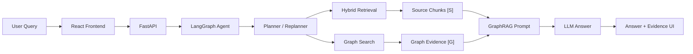

# PatentRAG: 中文专利 GraphRAG Agent 系统

PatentRAG 是一个面向中文专利文档的 Agentic RAG 项目。系统围绕 20 篇中文专利 Markdown 文档，构建了从文档解析、混合检索、知识图谱、GraphRAG、LangGraph Agent 到可解释前端工作台的完整链路。

这个项目的目标不是做一个简单问答 Demo，而是展示一个更接近真实业务场景的专利知识助手：用户可以提出技术问题、检索相关专利、分析已有方案、查看原文证据和图谱证据，并通过 Agent 工作台观察规划、工具调用和执行轨迹。

## Highlights

- **Hybrid Retrieval**: 支持 BM25 关键词检索、Chroma 向量检索和 Hybrid 检索。
- **GraphRAG**: 将原文 chunk 证据 `[S]` 与知识图谱证据 `[G]` 一起提供给 LLM 生成答案。
- **LLM Technical Graph Extraction**: 使用大模型抽取技术领域、技术问题、关键组件、技术方案和技术效果。
- **LangGraph Agent Runtime**: 使用 LangGraph 编排 Agent 节点，支持规划、工具调用、图谱增强问答、自检和最终回答。
- **Explainable Frontend**: React 工作台展示答案、Plan、Trace、LangGraph node trace、原文证据和图谱证据。
- **Evaluation Pipeline**: 提供 GraphRAG 评估问题集和自动评估脚本，用于记录证据命中率和引用覆盖率。

## Demo Questions

可以用下面的问题测试系统效果：

```text
哪些专利使用清洗箱、喷嘴或雾化器？它们分别解决了什么技术问题？
```

```text
哪些专利解决了护理床翻身、身体支撑或长期受压相关问题？
```

```text
我想设计一个医疗器械清洗装置，可以借鉴哪些现有专利结构，并需要避免哪些问题？
```

## Architecture



## Tech Stack

| Layer | Technologies |
| --- | --- |
| Backend | FastAPI, Pydantic, Typer |
| Agent Runtime | LangGraph |
| Retrieval | BM25, Chroma, Hybrid Search |
| Knowledge Graph | NetworkX JSON graph |
| LLM Integration | OpenAI-compatible client, DashScope/Qwen |
| Frontend | React, TypeScript, Vite |
| Testing | pytest, Node test runner |

## Project Structure

```text
configs/              Configuration templates
data/                 Local data, indexes, graph artifacts, evaluation cases
docs/                 Architecture docs, evaluation reports, implementation notes
frontend/             React + TypeScript frontend
logs/                 Local runtime logs
patant/               Raw Chinese patent Markdown files
scripts/              Data processing, graph building, evaluation and CLI scripts
src/patent_rag/       Backend, retrieval, graph, RAG and Agent source code
tests/                Python test suite
```

Large generated artifacts such as vector indexes and graph JSON files are ignored by Git. Rebuild them locally with the scripts below.

## Quick Start

### 1. Install Backend Dependencies

```powershell
cd D:\WorkTool\Patent_RAG
python -m venv .venv
.\.venv\Scripts\Activate.ps1
pip install -e ".[dev,llm,vector]"
```

If the virtual environment already exists:

```powershell
.\.venv\Scripts\Activate.ps1
```

### 2. Configure Environment

Copy `.env.example` to `.env`, then configure your model provider if you want LLM generation:

```dotenv
PATENT_RAG_LLM_PROVIDER=dashscope
PATENT_RAG_LLM_MODEL=qwen-plus
PATENT_RAG_LLM_MAX_TOKENS=4000
PATENT_RAG_DASHSCOPE_API_KEY=your-dashscope-api-key
PATENT_RAG_DASHSCOPE_BASE_URL=https://dashscope.aliyuncs.com/compatible-mode/v1
```

For offline tests, keep:

```dotenv
PATENT_RAG_EMBEDDING_PROVIDER=hashing
```

### 3. Build Local Data

```powershell
python scripts\ingest_patents.py
python scripts\build_chunks.py
python scripts\build_vector_index.py
python scripts\build_graph.py
```

To build an LLM-enhanced technical graph:

```powershell
python scripts\build_graph.py --llm-technical --llm-graph-max-patents 20 --output data\graph\patent_graph_llm_full20_fixed.json
```

### 4. Start Backend

```powershell
.\.venv\Scripts\python.exe -m uvicorn patent_rag.api.main:app --reload --app-dir src --host 127.0.0.1 --port 8000
```

API docs:

```text
http://127.0.0.1:8000/docs
```

Health check:

```powershell
Invoke-WebRequest http://127.0.0.1:8000/health
```

### 5. Start Frontend

```powershell
cd frontend
npm install
npm.cmd run dev -- --host 127.0.0.1 --port 5173 --strictPort
```

Open:

```text
http://127.0.0.1:5173/
```

If port `5173` is occupied, stop the old process first:

```powershell
netstat -ano | Select-String ':5173'
Stop-Process -Id <PID>
```

## Main API Endpoints

| Method | Endpoint | Description |
| --- | --- | --- |
| `GET` | `/health` | Service health check |
| `GET` | `/patents` | List parsed patents |
| `POST` | `/search` | Keyword/vector/hybrid patent search |
| `POST` | `/rag/ask` | RAG or GraphRAG question answering |
| `POST` | `/agent/run` | LangGraph Agent execution |
| `GET` | `/graph/stats` | Knowledge graph statistics |
| `GET` | `/graph/search` | Graph keyword search |

## Evaluation

GraphRAG evaluation files:

- `data/evaluation/graphrag_cases.jsonl`
- `scripts/evaluate_graphrag.py`
- `docs/evaluation/graphrag_eval_latest.md`

Latest recorded evaluation summary:

| Metric | Value |
| --- | ---: |
| Cases | 6 |
| Expected graph hit rate | 1.0 |
| Expected any hit rate | 1.0 |
| Graph citation rate | 1.0 |
| Source citation rate | 1.0 |
| Average answer length | 1868.33 |

Run evaluation:

```powershell
python scripts\evaluate_graphrag.py --cases data\evaluation\graphrag_cases.jsonl --output docs\evaluation\graphrag_eval_latest.json --markdown-output docs\evaluation\graphrag_eval_latest.md
```

## Testing

Backend tests:

```powershell
.\.venv\Scripts\python.exe -m pytest -q
```

Frontend tests:

```powershell
cd frontend
npm.cmd test
```

Frontend build:

```powershell
cd frontend
npm.cmd run build
```

Current verified status:

- Python test suite: `94 passed`
- Frontend evidence tests: `3 passed`
- Frontend production build: passed

## What The Agent Shows

The Agent workspace exposes more than the final answer:

- **Intent**: detected user task type, such as patent QA or idea analysis.
- **Plan**: planned tool steps.
- **Trace**: actual tool execution observations.
- **LangGraph node trace**: runtime node-level state.
- **Source evidence `[S]`**: original patent chunks from retrieval.
- **Graph evidence `[G]`**: structured technical evidence from the knowledge graph.

Graph evidence cards include technical fields, problems, components, solutions, effects, matched terms and supporting chunk ids.

## Roadmap

- Add more end-to-end evaluation cases and answer-quality scoring.
- Improve LLM planner and replanner with stricter structured-output validation.
- Add graph visualization for patent-component-problem-solution relations.
- Add streaming Agent output for long-running tasks.
- Package a public demo dataset and screenshots for easier GitHub review.

## Notes

This repository intentionally keeps generated local artifacts out of Git:

- `.env`
- `frontend/dist`
- `frontend/node_modules`
- `data/processed`
- `data/indexes`
- `data/graph`

Use the build scripts to regenerate them locally.
